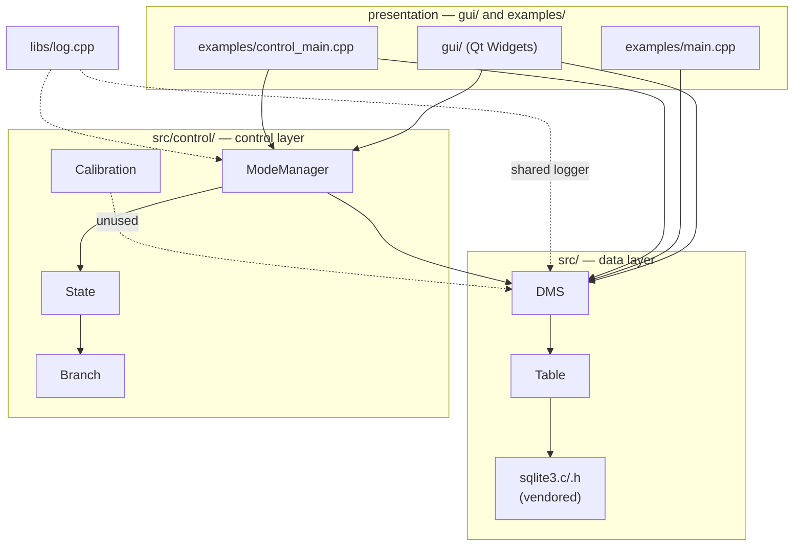
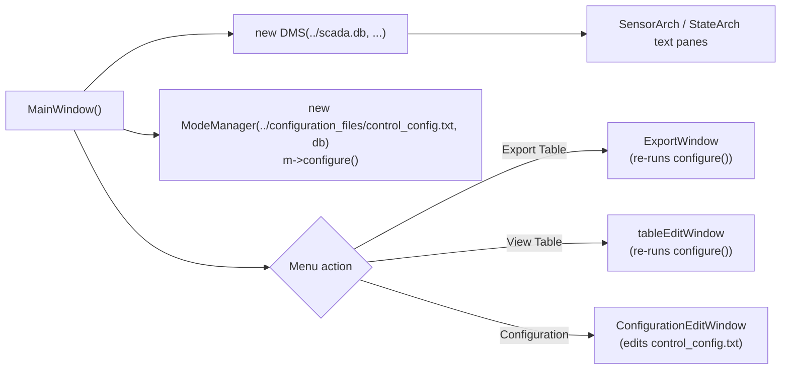

# SCADA
Reference Manual
Module & Architecture Reference

**Author:** Maxwell McFarlane
**Date:** 2026-09-23
**Version:** 2.0
**Branch:** `modernize-gui-control`

---
## Table of Contents
1. Overview
2. System Flow
3. Module Reference
4. Known Limitations
5. Revision History
6. Related Documents
7. References

---
## 1. Overview
SCADA is a small data-management-and-control stack built on a vendored SQLite amalgamation. It has three layers:

- **Data layer** (`src/`) — `DMS` (one `sqlite3*` handle, a list of `Table*`, a shared `Log*`) and `Table` (schema + CRUD + query + CSV export over one SQLite table), plus the vendored `sqlite3.c`/`.h`.
- **Control layer** (`src/control/`) — `State`, `Branch`, `ModeManager` implement a config-driven finite state machine (state → branch-on-SQL-condition → next state) over the same `DMS`. `Calibration` (linear/quadratic sensor calibration) lives here too but nothing currently constructs it.
- **Presentation layer** — a Qt Widgets GUI (`gui/`) and two console drivers (`examples/main.cpp`, `examples/control_main.cpp`), all built directly against the two layers above. There is no service boundary between them; every entry point links the same `.cpp` files.

`libs/log.cpp`/`log.h` is a small shared logger (`std::ofstream` wrapper, append-mode by default, with an explicit `truncate()`) used by all three layers — it is the only piece of what used to be called the "supervisory layer" that has real content.

This branch (`modernize-gui-control`) removed `legacy/scada_2017/` — a full import of the original 2017 Lafayette CS205 course project, including its own commit history — and replaced it with the two pieces of it that were actually load-bearing: the GUI and the control subsystem, ported to build against the modern `src/` data layer instead of a separate, near-duplicate copy of it. Everything else that lived under `legacy/` (Phidget hardware test rigs, named-pipe experiments, a vendored gtest copy, IDE project files) had no dependents anywhere in the codebase and was dropped rather than carried forward; it is still fully present in `master`'s history if it's ever needed.

---
## 2. System Flow

### 2.1 DMS console example (`examples/main.cpp`, `make run_example`)
- **Construct:** `DMS db("../scada.db", "../configuration_files/deftables_config.txt", "../log.txt")` at file scope — opens the SQLite db, sets `PRAGMA foreign_keys = ON`, auto-creates `ConfigFileTable`, parses the config file into per-table `CREATE TABLE` calls.
- **Load:** eight `db.loadDataBase(path)` calls (dependency order) against `testbench_files/*.txt`, plus two `db.loadConfigTable(name, path)` calls against `configuration_files/*.txt`.
- **Query/exercise:** `testSampleTable`, `testQueries`, `testCalTable`, `testResetRowID`, `testTableFnc`, `testMultiQuery`, `testExport`, `testClrTable` — `createQuery`, `controlQuery`, `updateTable`, `addMultiToTable`, `getTableHeaders`, `isSensorExist`.
- **Export:** `Table::exp` writes `../data.csv`, `../data1.csv`, `../data2.csv`.
- **Close:** `db.close()`.

### 2.2 Control-subsystem console example (`examples/control_main.cpp`, `make run_control_example`)
Same `DMS` construction and config/testbench loading as above, then:
- `ModeManager m("../configuration_files/control_config.txt", &db)` — parses `control_config.txt`'s `STATES:`/`BRANCHES:` sections, builds one `State` per name and one `Branch` per `<from>,<to>,<SQL condition>` line, and sets `currentState` to the first declared state.
- `m.configure()` does the parse; `m.nextstate()` (not called by either example) would evaluate the current state's branch conditions via `DMS::controlQuery` and advance `currentState` on the first true one.

### 2.3 GUI (`gui/`, `make run_gui` / `bin/scada`)
`MainWindow`'s constructor does the same `DMS` + `ModeManager` construction as the console examples (same relative paths, so it must be launched with cwd = `gui/` — see §3.8), then populates two read-only text panes (`SensorArch`, `StateArch`) from `SELECT * FROM SensorTable` / `StateTable`. Three menu actions open modeless child widgets that share the same `DMS*`:
- **Export Table** → `ExportWindow` (pick a table + filter, preview, write CSV) — re-runs `m->configure()` on open, re-parsing the control config.
- **View Table** → `tableEditWindow` (browse/edit rows) — also re-runs `m->configure()`.
- **Configuration** → `ConfigurationEditWindow` (edit `control_config.txt` in place, save, re-validate via `ModeManager`) — does *not* re-run `configure()` after a save (see §4).

---
## 3. Module Reference

### 3.1 `src/dms.cpp`, `src/dms.h`
`DMS`: one `sqlite3*` handle, `vector<Table*> sensList`, `Log* log`, a `currentState` string. Four constructors (name-only, name+dbConfig, name+dbConfig+logPath, plus the implicit default), `createTable`/`getTable`/`dumpTable`/`clearTable`, `controlQuery`, `loadDataBase`, `loadConfigTable`, `getTableHeaders`, `isSensorExist`, `setCurrentState`/`getCurrentState`, static `sqlite3_exec` callbacks. `resetRowIdTable(tableName, col)` is a one-line logging stub, not implemented.

### 3.2 `src/table.cpp`, `src/table.h`
`Table`: constructors for a generic dimension string plus hardcoded `HubTable`/`SampleTable`/`CalibrationTable` schemas. `addToTable`/`addMultiToTable`, `delRow`, `createQuery` (two overloads), `isQueryEmpty`, `updateTable`, `exp` (CSV export), `count`. Same static-callback-into-`void*`-cast-`string*`/`Log*` pattern as `DMS`.

### 3.3 `src/control/branch.cpp`, `branch.h`
`Branch`: a target `State*` and a `condition` string (a raw SQL fragment, evaluated later via `DMS::controlQuery`). Constructor only; no behavior of its own.

### 3.4 `src/control/state.cpp`, `state.h`
`State`: a `name` and a `vector<Branch>`. `loadBranch` appends; `nextstate(DMS* db)` walks the branches in order and returns the target state's name for the first branch whose `condition` query returns a non-empty result — first-match-wins, no explicit "no transition" case beyond returning the current name unchanged.

### 3.5 `src/control/modemanager.cpp`, `modemanager.h`
`ModeManager`: owns `vector<State> states`, `vector<string> sensors`, `currentState`, a `DMS*`, and two `Log*` members (`errorLog` → `../control_error.txt`, `log` → `../control_log.txt`, both truncated at the start of `configure()` via the new `Log::truncate()`). `configure()` line-parses the config file's `STATES:` and `BRANCHES:` sections (format: `STATES:` then a comma-separated name list; `BRANCHES:` then `from,to,condition` lines; `END` terminates), logging one line per state/branch created or rejected, and sets `currentState` to the first declared state. `nextstate()` delegates to the current `State::nextstate(db)`. `getState(name)` and `sensorExists(name)` are linear lookups.

### 3.6 `src/control/calibration.cpp`, `calibration.h`
`Calibration`: given a `DMS*`, `calibrate()` is meant to read `CalConfTable` coefficients and write calibrated values back via `db`. **Not constructed anywhere** in `gui/` or either console example — carried forward from the legacy code as-is because it's real, non-trivial logic, but it isn't wired into any entry point yet.

### 3.7 `libs/log.cpp`, `libs/log.h`
`Log` wraps a `std::ofstream`. `Log()` opens `dms.log`; `Log(filePath)` opens `filePath`. `open(filePath)` closes any existing stream, tracks the path, and reopens in append mode, falling back to `dms.log` if the requested path can't be opened. `truncate()` (added on this branch, for `ModeManager`'s legacy `trunc_file()` call) reopens the tracked path with `ios::trunc`. A template `operator<<(const T&)` forwards any streamable value; a separate overload handles manipulators like `std::endl`. `isOpen()`/`flush()` are thin accessors.

### 3.8 `gui/` (Qt Widgets, `scadagui.pro`)
`main.cpp` → `QApplication` + `MainWindow`. `mainwindow.{h,cpp}` is described in §2.3. `exportwindow.*`, `tableeditwindow.*`, `configurationeditwindow.*` are modeless child widgets, each holding the same `DMS*` passed in from `MainWindow`. `calibrationwindow.ui` exists (a Qt Designer form) but has no corresponding `.h`/`.cpp` class — it was never wired up in the original 2017 code and still isn't. All paths inside `gui/*.cpp` (`../scada.db`, `../configuration_files/...`, `../control_config.txt`, `../log.txt`) are relative to the **process's working directory**, not the source file location — the app must be launched with cwd = `gui/`, which is what `bin/scada` and the `run_gui` Makefile target do (a plain `open scadagui.app` from Finder or elsewhere would break this).

Build note: `scadagui.pro` builds against the shared `../src/sqlite3.c`/`.h`, `../src/dms.cpp`/`table.cpp`, `../libs/log.cpp`, and `../src/control/{branch,state,modemanager}.cpp` — no vendored copies. qmake's `macx-clang` mkspec unconditionally links `-framework AGL`, which no longer ships with current macOS SDKs; the `gui` Makefile target strips it from the generated Makefile before building (see §3.11).

### 3.9 `examples/main.cpp`
Described in §2.1. Builds to `examples/scada_example`.

### 3.10 `examples/control_main.cpp`
Described in §2.2. Builds to `examples/control_example`. Added on this branch to replace `legacy/scada_2017/scada/main.cpp`'s console driver, with the dead `Scada` class and unused `Calibration` instantiation attempt dropped.

### 3.11 `examples/ui/`, `bin/scada`
`examples/ui/README.md` + `run.sh` is a thin pointer at the real GUI source (`gui/`) and at `bin/scada`, kept for symmetry with `examples/main.cpp` and `examples/control_main.cpp` rather than duplicating Qt project files. `bin/scada` builds the GUI on first run (`make gui`) if `gui/scadagui.app` doesn't exist yet, then runs the binary directly with cwd = `gui/` (not `open`, which would launch the app with an unpredictable working directory and break the relative paths in §3.8).

### 3.12 `Makefile`
`example` / `run_example` / `control_example` / `run_control_example` build and optionally run the two console drivers with plain `g++ -std=c++17`. `gui` runs `qmake` + the AGL workaround + `make` in `gui/`; `run_gui` builds then launches with the correct cwd; `gui_clean` removes GUI build output. `clean` removes generated runtime files (logs, `scada.db`, CSV exports) and depends on `gui_clean`. All targets are declared `.PHONY` — without that, a target whose name matches an existing top-level directory (as `gui` now does) silently no-ops instead of running, which is exactly what happened once `gui/` was created and is why `.PHONY` was added on this branch.

---
## 4. Known Limitations
- **`Calibration` is unwired** (§3.6) — real logic, no caller.
- **`calibrationwindow.ui` has no controller class** — a designed-but-never-implemented GUI feature, carried forward as-is.
- **`ConfigurationEditWindow` doesn't re-validate on save** — the other two child windows call `m->configure()` when opened; the config editor does not call it after writing `control_config.txt`, so a `ModeManager` already open in `MainWindow` won't see edits until the app restarts.
- **`ModeManager::nextstate()` is never called** by either console example or the GUI — the state machine parses and holds state/branch data but nothing currently drives a transition.
- **Log files reset on every `configure()` call** — `ModeManager::configure()` truncates `control_log.txt`/`control_error.txt` unconditionally, so opening `ExportWindow`/`tableEditWindow` (both call `configure()`) discards prior log content, not just on startup.
- **`resetRowIdTable` is a stub** on `DMS` — logs a message and returns, does not reset a rowid sequence.

---
## 5. Revision History
| Version | Date | Author | Description |
|---|---|---|---|
| 1.0 | 2026-09-16 | Maxwell McFarlane | Initial generated reference manual (pre-branch: `src/`+`libs/` only, `examples/main.cpp` as sole entry point). |
| 2.0 | 2026-09-23 | Maxwell McFarlane | Rewritten for the `modernize-gui-control` branch: `legacy/scada_2017/` removed; GUI and control subsystem ported to top-level `gui/` and `src/control/`; added `examples/control_main.cpp`, `Log::truncate()`, `bin/scada`. |

---
## 6. Related Documents
- `docs/archive/` — 2017 Lafayette CS205 course deliverables (report, design proposal, grading assessment, final presentation) and `Manual-export.docx`, a prior Word export of this manual.
- `docs/models.drawio`, `docs/scada-*.png` — original design diagrams (not re-derived in this manual; may not reflect the current `gui/`/`src/control/` layout).
- `docs/readme.md` — one-paragraph repo summary.
- `master` branch — still has the full `legacy/scada_2017/` tree (2017 CollectionDev/, Phidget test code, vendored gtest, and the original nested-repo commit history, imported intact) for anything not carried forward here.

---
## 7. References
- [SQLite](https://www.sqlite.org/) — vendored amalgamation, used unmodified as the storage engine (`src/sqlite3.c`/`.h`).
- [Qt](https://www.qt.io/) Widgets — `gui/`'s UI toolkit; built and verified against Qt 6.7.3 via `qmake`, despite the project file predating Qt6.
