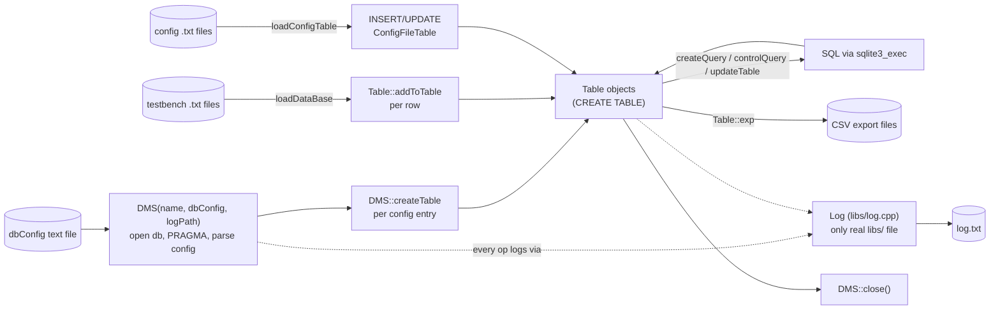
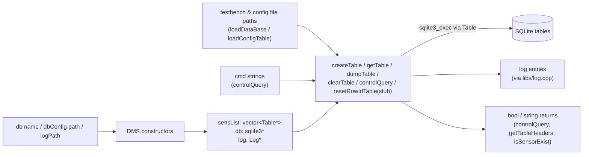
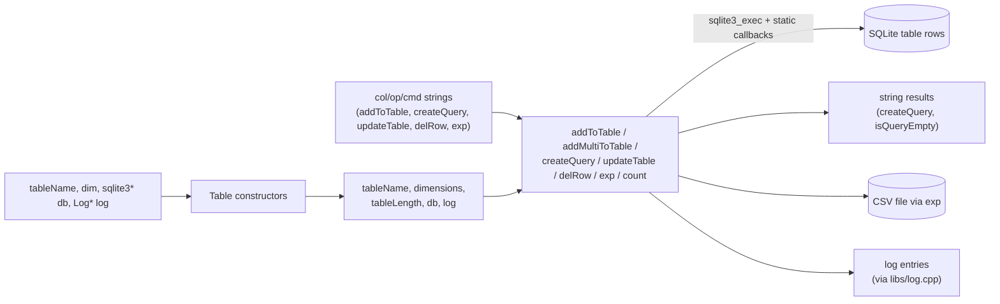
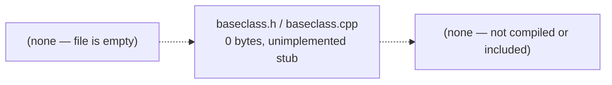
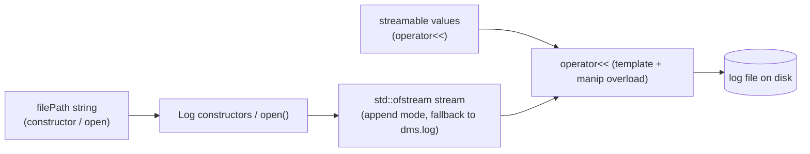
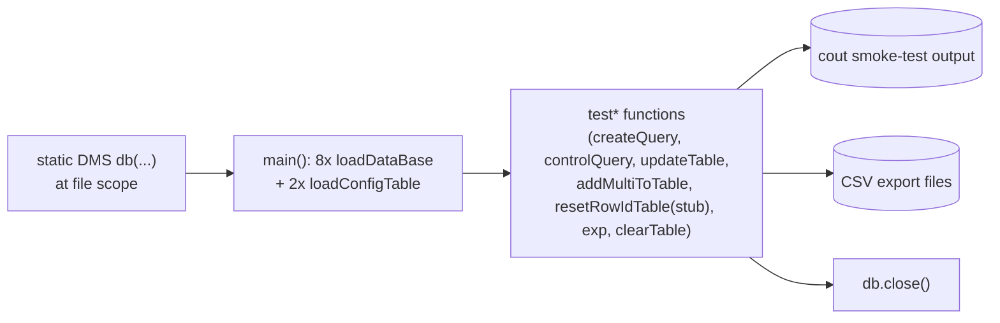

# SCADA
Reference Manual
Module & Architecture Reference

**Author:** Maxwell McFarlane
**Date:** 2026-09-16
**Version:** 1.0

---
## Table of Contents
1. Overview
2. System Flow
3. Module Reference
4. Revision History
5. Related Documents
6. References

---
## Revision History
| Version | Date | Author | Description |
|---|---|---|---|
| 1.0 | 2026-09-16 | Maxwell McFarlane | Initial generated reference manual. |

---
## 1. Overview
`SCADA` reuses [[DMS]]'s `DMS`/`Table`/vendored-SQLite data layer (`src/dms.cpp`, `src/table.cpp`, `src/sqlite3.c`/`.h` — directly descended from the same source, confirmed by identical git remote and near-identical file diffs) and adds a `libs/` directory meant to hold the "supervisory layer" (`baseclass`, `macros`, `Log`) that `dms.h`/`table.h` expect at `../tools/`. Of the three, only `libs/log.cpp`/`log.h` has real content — a small `std::ofstream` wrapper with a template `operator<<` and a fallback-to-`dms.log` constructor. `libs/baseclass.h`, `libs/baseclass.cpp`, `libs/macros.h`, and `libs/macros.cpp` all exist but are 0 bytes; their corresponding `#include` lines in `src/dms.h`/`src/table.h` are commented out. `examples/main.cpp` is the sole entry point, functionally identical to [[DMS]]'s `ws/main.cpp`. The repo does not build as checked out because `src/dms.h`/`src/table.h` hardcode `#include "../tools/log.h"` but the sibling directory here is named `libs/`, not `tools/` — the Makefile's `example` target has the same mismatch. Unlike [[DMS]], this repo's `DMS::resetRowIdTable()` has a one-line logging stub rather than a commented-out body, so once the `tools/`-vs-`libs/` path is fixed, the example driver links and runs (verified).

---
## 2. System Flow
Runtime flow, as exercised by `examples/main.cpp` (functionally the same lifecycle as [[DMS]]'s driver, plus routing through `libs/log.cpp` for logging):
- **Construct:** `DMS db("../scada.db", "../configuration_files/deftables_config.txt", "../log.txt")` at file scope — opens the SQLite db, sets `PRAGMA foreign_keys = ON`, auto-creates `ConfigFileTable`, parses the config file into per-table `CREATE TABLE` calls. Every `DMS`/`Table` operation that logs routes through the shared `Log*`, which is the only real piece of `libs/` — `baseclass`/`macros` are 0-byte stubs and contribute nothing at runtime.
- **Load:** eight `db.loadDataBase(path)` calls in dependency order, plus two `db.loadConfigTable(name, path)` calls (one with a hardcoded absolute path off the original author's machine, same issue as [[DMS]]).
- **Query:** the same `test*()` battery as [[DMS]] — `createQuery`, `controlQuery`, `updateTable`, `addMultiToTable`, `getTableHeaders`, `isSensorExist`, `resetRowIdTable` (here a no-op stub that logs "not currently implemented" instead of failing to link).
- **Export:** `Table::exp` writes CSV files (`../data.csv`, `../data2.csv`, `../data1.csv`).
- **Close:** `db.close()`.

There is no separate FSM (Initialize → Calibration → Update → Event/Exception) in the code — `DMS::setCurrentState`/`getCurrentState` are plain string accessors with no transition logic, so the diagram below reflects the actual linear lifecycle, not the aspirational design in `docs/`.

---
## 3. Module Reference

### 3.1 src/dms.cpp, src/dms.h
Same class shape as [[DMS]]'s `DMS` — one `sqlite3*` handle, `vector<Table*> sensList`, `Log* log`, `currentState` string, and the same four constructors, `createTable`/`getTable`/`dumpTable`/`clearTable`, `controlQuery`, `loadDataBase`, `loadConfigTable`, `getTableHeaders`, `isSensorExist`, `setCurrentState`/`getCurrentState`, and the same static callbacks. Verified two functional differences from [[DMS]]'s `src/dms.cpp`/`dms.h`: (1) `dms.h` here comments out `#include "../tools/macros.h"` and `"../tools/baseclass.h"`, leaving only `../tools/log.h` active (both repos' headers still reference the nonexistent `../tools/` path rather than the local `libs/` directory — the include-path bug the project doc documents); (2) `DMS::resetRowIdTable(string tableName, string col)` is not commented out here — it has a one-line body that logs `"resetRowIdTable is not currently implemented for table: " + tableName + ", column: " + col` and returns, so (unlike [[DMS]]) any driver calling it links successfully. The default-constructor `Log*` member initializer also differs trivially (`new Log()` here vs. `new Log("../error_files/dms_log.txt")` in [[DMS]]), consistent with `libs/log.h`'s parameterless-constructor fallback to `dms.log`.

### 3.2 src/table.cpp, src/table.h
Byte-for-byte the same API and logic as [[DMS]]'s `Table` — same constructors (generic dimension string, plus hardcoded `HubTable`/`SampleTable`/`CalibrationTable` schemas), `addToTable`/`addMultiToTable`, `delRow`, `createQuery` (two overloads), `isQueryEmpty`, `updateTable`, `exp`, `count`, and the same static-callback pattern (`cbAddToTable`, `cbCreateQuery`, `cbExp`, etc.) accumulating `sqlite3_exec` output into a `void*`-cast `string*`/`Log*`. The only diffs found by direct comparison against [[DMS]]'s `table.h`/`table.cpp`: `table.h` here comments out the `../tools/macros.h` and `../tools/baseclass.h` includes (same as `dms.h`), and `Table::cbSize` in `table.cpp` has an explicit `return 0;` at the end where [[DMS]]'s copy falls off the end of a non-void function without one (a latent UB/warning fixed here, not a behavioral change in practice).

### 3.3 libs/baseclass.cpp, libs/baseclass.h
Both files exist in the repo but are **0 bytes** — confirmed directly (`ls -la` shows 0-byte size for each). No supervisory/base-class logic is implemented anywhere in this repo. The corresponding `#include "../tools/baseclass.h"` lines in `src/dms.h`/`src/table.h` are commented out, so nothing references these files at compile time; they are placeholders only.

### 3.4 libs/log.cpp, libs/log.h
The one real piece of the intended supervisory layer. `Log` wraps a `std::ofstream` opened in append mode (`ios::out | ios::app`). Constructors: parameterless (`Log()`, opens `"dms.log"`) and `explicit Log(const string& filePath)`. `open(filePath)` closes any existing stream and reopens at the new path, falling back to a local `dms.log` if the requested path can't be opened (e.g. a missing parent directory) — this is what makes `DMS`'s `../error_files/dms_log.txt` / `../log.txt` paths silently degrade rather than crash when directories don't exist. A template `operator<<(const T&)` forwards any streamable value directly to the file stream (used throughout `dms.cpp`/`table.cpp` as `*log << ...`); a separate non-template overload handles stream manipulators (e.g. `std::endl`). `isOpen()` and `flush()` are thin accessors; the destructor flushes and closes.

### 3.5 libs/macros.cpp, libs/macros.h
Both files exist but are **0 bytes** — confirmed directly. No macro helpers are implemented. Like `baseclass.*`, the `#include "../tools/macros.h"` lines that would pull this in are commented out in `src/dms.h`/`src/table.h`, so this module is inert placeholder content only.

### 3.6 examples/main.cpp
Entry point and smoke-test driver, functionally identical to [[DMS]]'s `ws/main.cpp`: statically constructs `DMS db("../scada.db", "../configuration_files/deftables_config.txt", "../log.txt")`, loads the same eight testbench files in the same dependency order, calls `loadConfigTable` twice with the same hardcoded absolute path (`/Users/maxwellmcfarlane/scada_repo/configuration_files/...`), and runs the same eight `test*()` functions (`testSampleTable`, `testQueries`, `testCalTable`, `testResetRowID`, `testTableFnc`, `testMultiQuery`, `testExport`, `testClrTable`). Differs from [[DMS]]'s driver only in include paths (`#include "../src/dms.h"` / `"../src/table.h"` directly, vs. [[DMS]]'s local `table.h`) and two locally defined but unused macros, `CONFIG_PATH`/`DB_PATH`. Because `DMS::resetRowIdTable()` has a real (if stub) body in this repo's `dms.cpp`, `testResetRowID()` calling it does not break the link — this file builds and runs successfully once the `tools/`-vs-`libs/` include path is worked around (verified: a committed `examples/scada_example` binary plus `examples/dms.log`, `scada.db`, `log.txt` at the repo root confirm it has been run before).

---
## 4. Related Documents
- [[SCADA]] — project-level doc (status, timeline, roadmap, build verification) at `../docs/Projects/SCADA/SCADA.md`
- [[DMS]] Manual — `../DMS/Manual.md`, the upstream project this repo's `src/dms.cpp`/`table.cpp`/`sqlite3.c` are directly descended from (same git remote, near-identical sources)
- `readme.md` — repo root readme (currently an unedited copy of DMS's README)
- `TECH-SUMMARY.md` — design notes describing the aspirational Initialize → Calibration → Update → Event/Exception FSM, not implemented in this codebase
- `docs/cs205_report.pdf`, `docs/formal_design_proposal_cs205.docx`, `docs/ScadaFinalDocumentation_Max_Robson_Hayden/` — original 2017-2018 course deliverables
- `docs/models.drawio`, `docs/scada-*.png` — original design diagrams (not re-derived in this manual)

---
## 5. References
- [SQLite](https://www.sqlite.org/) — vendored amalgamation, v3.21.0, byte-identical to [[DMS]]'s copy, used unmodified as the storage engine
